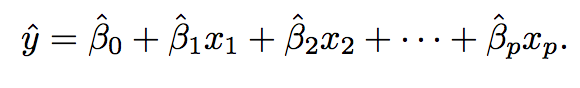
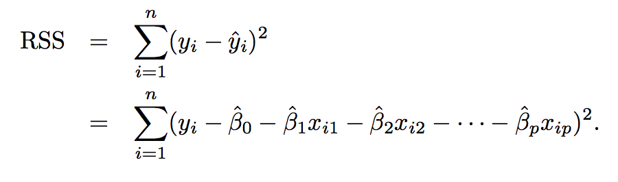
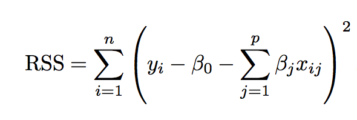
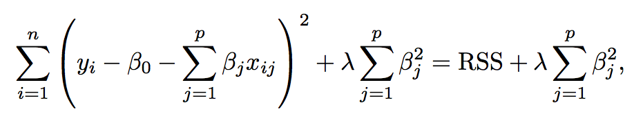
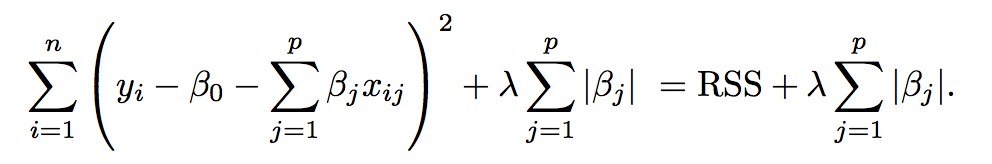

```{r setup, include=FALSE}
knitr::opts_chunk$set(warning = F, message = F, cache = T, echo = F)
```

## Introduction

The dataset contains the final selling prices of 1460 homes in Ames, Iowa along with 79 explanatory variables describing (almost) every aspect of the house. A home buyer doesn't usually consider the height of the basement ceiling or the distance to an east-west railroad while evaluating the fair price for a house. Through statistical modelling, we will attempt to obtain what really influences price negotiations other than the number of bedrooms or the total area.

## Goal of the project

Build linear and regularized linear models to predict sales price for house.

## Evaluation metric

RMSE - Root Mean Square Error

## Process

1. Data cleaning
    + Identify missing values and outliers and handle them
2. Exploratory Data Analysis
    + Univariate analysis
        * Analyze the dependent variable, `SalesPrice`
    + Multivariate analysis
        * Analyze relationship between dependent and independent variables
            * numeric variables - correlation
            * categorical variables - distributrion across categories
3. Identify relatively important features based on a combination of instinct and numerical analysis.
4. Build linear model and evaluate performance
5. Build regularised linear model (Ridge Regression, Lasso regression)

\pagebreak

## Data preparation

### A. Data cleaning

The table below shows missing fields for each column as an absolute number and also as a percentage. 

```{r}
library(ggplot2)
library(plyr)
library(dplyr)
library(caret)
library(moments)
library(glmnet)
library(elasticnet)
library(knitr)
library(readr)
library(tibble)
library(scales)
library(corrplot)


# Read data
train <- read.csv('data/train.csv', stringsAsFactors = T)
test <- read.csv('data/test.csv', stringsAsFactors = T)

# Count missing values
missing.count <- colSums(sapply(train, is.na))
missing.count <- missing.count[missing.count > 0]
missing.count <- as_tibble(data.frame(column = names(missing.count),
                           count = missing.count,
                           row.names = NULL))

missing.count <-
  missing.count %>%
  mutate(percent_missing = round(100 * (count / nrow(train)),2)) %>%
  arrange(desc(count))
  
missing.count
```

__Handling the missing data__

* PoolQC, MiscFeature, Alley, Fence, FireplaceQu:  
    + All categorical variables where NA represents absence of the feature and not missing data.
    + We can remove PoolQC, MiscFeature, Alley since they have over 90% of values missing
* Garage Variables
    + Data is missing when no garage is present 
    * GarageType, GarageFinish, GarageQual, GarageCond
        * NA can be taken as a different category
    * GarageYrBit
        * We can remove this variable
* Basement Variables
    + Missing data represents no basement
    * BsmtExposure, BsmtFinType1, BsmtFinType1, BsmtQual, BsmtCond
        * NA can be taken as a different category
* MasVnrType
    + Masonry veneer type, NA represents no veneer
* MasVnrArea
    + Masonry veneer area, NA represents no veneer we can substitute with 0.
* Electrical
    + 1 missing observation. We can delete this observation
* LotFrontage
    + Can't set this to zero as it doesn't make sense that a house has no distance between the street
    + To handle LotFrontage, it seems instinctive that it will be related to LotArea. We will substitue missing LotFrontage value with the square root of the lotarea

For most variables, missing values just denote an absence of the feature from the house and can also be treated as a separate category.

### B. Variable Transformations

We will transform our target variable, SalePrice by taking its log.
Since SalePrice varies over a large range we use the log transformation to ensure errors in predicting cheap and expensive houses are treated the same way.

\pagebreak

## Exploring the data

### Univariate analysis

__Inter-quartile range__

```{r}
summary(train$SalePrice)
```

__Distribution__


```{r, fig.height = 3, fig.width = 3, fig.align="center"}
  ggplot(data = train) +
  geom_histogram(mapping = aes(SalePrice),
                 fill = "#3498db",
                 color = "#2980b9",
                 binwidth = 10000) +
  scale_x_continuous(labels = comma_format()) +
  geom_vline(mapping = aes(xintercept = mean(train$SalePrice)),
                           colour = '#e74c3c',
                           size = 0.5) +
  geom_vline(mapping = aes(xintercept = median(train$SalePrice)),
                           colour = '#f39c12',
                           size = 0.5) +
  labs(x = "Sale Price",
       y = "Count")
```

We can see that the distribution of the sale prices is left skewed.
The mean (Red line) is slightly higher than the median (Yellow line). 

Let us try a log transformation on the SalePrice variable.

```{r, fig.height = 3, fig.width = 3, fig.align="center"}
  ggplot(data = train) +
  geom_histogram(mapping = aes(log(SalePrice)),
                 fill = "#3498db",
                 color = "#2980b9") +
  scale_x_continuous(labels = comma_format()) +
  geom_vline(mapping = aes(xintercept = log(mean(train$SalePrice))),
                           colour = '#e74c3c',
                           size = 0.5) +
  geom_vline(mapping = aes(xintercept = log(median(train$SalePrice))),
                           colour = '#f39c12',
                           size = 0.5) +
  labs(x = "Log(Sale Price)",
       y = "Count")
```

A log transformation can be seen to display a more normal distribution although we can still see an evident left skew. The log transformation moreover helps treat errors in both cheap and expensive house alike.

### Relationship with other numeric variables

Let us look at the correlation between the numeric variables and the sale price.

Between the numeric variables we see significant correlations. Some of these are between:

* Lot area and lot frontage
* Overall condition and year built
* Total basement surface area and 1st floor surface area
* Number of cars parkable in the garage and overall condition


```{r, fig.height = 12, fig.width = 10}
for.cor <- 
  train %>%
  dplyr::select(-c(GarageYrBlt, Id)) %>%
  mutate(MasVnrArea = ifelse(is.na(MasVnrArea),
                                   0,
                                   MasVnrArea)) %>%
  filter(!is.na(Electrical)) %>%
  mutate(LotFrontage = ifelse(is.na(LotFrontage),
                              sqrt(LotArea),
                              LotFrontage))

for.cor[is.na(for.cor)] <- "None"

nums <- sapply(for.cor, is.numeric)
M <- cor(for.cor[, nums])
corrplot(M, method = "circle", type = "upper")
```


Diving deeper into the most correlated variables to the sale price, we are restricting this list to only the variables that have a correlation of at least 0.5

```{r, fig.height = 4, fig.width=5, fig.align='center'}
M.tbl <- as_tibble(data.frame(variable = rownames(M),
                              correlation = M[, 36]))
var.cor <- 
  M.tbl %>%
  filter((abs(correlation) > 0.5) & (abs(correlation) < 1)) %>%
  arrange(desc(correlation))

ggplot(data = var.cor) +
  geom_bar(mapping = aes(x = reorder(variable, correlation),
                         y = correlation),
           stat = "identity",
           fill = "#27ae60",
           color = "#16a085",
           width = 0.5) +
  labs(x = "Variable",
       y = "Correlation") +
  coord_flip()
```

The top correlated variables can be validated intuitively as well.

* Overall quality of the house
* Above ground living area, Total basement surface area, 1st floor surface area
    + We can remove 2 of these as we expect these to be measuring the same feature
* Garage cars and garage area
    + We can remove one of these as these are both measuring the same feature
* Number of bathrooms above ground
* Total rooms above ground
* Year the house was built
* Year the house was last remodelled

\pagebreak

## Modelling

```{r}
rmse <- function(predicted, actual) {
  return(sqrt(mean((predicted - actual)^2)))
}
mse <- function(predicted, actual) {
  return(mean((predicted - actual)^2))
}
mae <- function(predicted, actual) {
  return(mean(abs(predicted - actual)))
}
mape <- function(predicted, actual) {
  return(mean(abs(predicted - actual)/actual))
}
```

```{r}
all_data <- rbind(train[, 1:ncol(train)-1],
                  test[, 1:ncol(test)])

df <- rbind(data.frame(version="log_price",
                       x=log(train$SalePrice + 1)),
            data.frame(version="price",
                       x=train$SalePrice))
# transform SalePrice target to log form
train$SalePrice <- log(train$SalePrice + 1)

# for numeric feature with excessive skewness, perform log transformation
# first get data type for each feature
feature_classes <- sapply(names(all_data),function(x){class(all_data[[x]])})
numeric_feats <-names(feature_classes[feature_classes != "factor"])

# determine skew for each numeric feature
skewed_feats <- sapply(numeric_feats[2],function(x){skewness(all_data[[x]],na.rm=TRUE)})

# keep only features that exceed a threshold for skewness
skewed_feats <- skewed_feats[skewed_feats > 0.75]

# transform excessively skewed features with log(x + 1)
for(x in names(skewed_feats)) {
  all_data[[x]] <- log(all_data[[x]] + 1)
}


# get names of categorical features
categorical_feats <- names(feature_classes[feature_classes == "factor"])

# use caret dummyVars function for hot one encoding for categorical features
dummies <- dummyVars(~.,all_data[categorical_feats])
categorical_1_hot <- predict(dummies,all_data[categorical_feats])
categorical_1_hot[is.na(categorical_1_hot)] <- 0  #for any level that was NA, set to zero

numeric_df <- all_data[numeric_feats]

for (x in numeric_feats) {
  mean_value <- mean(train[[x]],na.rm = TRUE)
  all_data[[x]][is.na(all_data[[x]])] <- mean_value
}

all_data <- cbind(all_data[numeric_feats],categorical_1_hot)

# create data for training and test
X_train <- all_data[1:nrow(train),]
X_test <- all_data[(nrow(train)+1):nrow(all_data),]
y <- train$SalePrice
```

We will first clear a base linear model based on only the limited variables.
We will then construct a full model with all variables and see how much we can improve on the base linear model.
We will finally used regularized models, ridge regression and lasso regression to counter the complexity of the full model.

Through the different linear models we will try to answer the following questions:

1. Is there a relationship between the SalePrice and the other variables?
2. How strong is this relationship?
3. Which features of the house influence the SalePrice?
4. How precisely can we estimate the influence of each factor on the SalePrice
5. How accurately can we predict future SalePrice?


## Linear Model

A linear model is one of the simplest and widely used approach for supervised learning. Linear regression is a statistical model that can be used to predict quantitative response. A lot of modern and complex statistical modelling techniques are an extension or generalization of the linear model. We will employ the least squares approach which is often used for linear models.

If we have _p_ different predictors, then the multiple linear regression models looks like,

$Y = {\beta_0} + {\beta_1}{X_1} + {\beta_2}{X_2} + ··· + {\beta_1}{X_1} + \epsilon$

where 
$X_i$ represents the ith predictor and  
$\beta_i$ represents the association between the predictor and the response

If we know the coefficients we can then make a prediction for the sale price of a future house using the formula,

```{r, out.width = "300px", out.height="150px"}

```

The parameter coefficients are estimated using the least squares method i.e. we will choose the values for $\beta_0, \beta_1, \beta_2, ··· ,\beta_p$ that minimize the sum of residual squares

```{r, out.width = "300px", out.height="175px"}

```

```{r}
abc <- cbind(X_train, SalePrice = y)

base.model <- lm(SalePrice ~ OverallQual + GarageArea +
                 GrLivArea + TotRmsAbvGrd + FullBath + YearBuilt,
               data = as.data.frame(abc))
# RMSE
base.in.sample.pred <- predict(base.model)
base.out.sample.pred <- predict(base.model,
                           data = X_test)
write_csv(x = as.data.frame(base.out.sample.pred),
          path = 'data/base_model.csv')
```

Overall quality, total number of rooms above ground, number of bathrooms above ground, garage area and year built. We will consider this to be our base model as this is an intuitive model.

__Base model equation__:

_SalePrice ~ OverallQual + GarageArea + GrLivArea + TotRmsAbvGrd + FullBath + YearBuilt_

|Metric|Value|Insight|
|--|--|--|
|$R^2$|`r round(summary(base.model)$r.squared, 3)`||
|$Adjusted R^2$|`r round(summary(base.model)$adj.r.squared, 3)`||
|RMSE|`r round(rmse(base.in.sample.pred, y), 3)`||


__Full Model__:

We now consider a model with all variables

```{r}
abc <- cbind(X_train, SalePrice = y)

lm.model <- lm(SalePrice ~ .,
               data = as.data.frame(abc))
# RMSE
in.sample.pred <- predict(lm.model)
out.sample.pred <- predict(lm.model,
                           data = X_test)
write_csv(x = as.data.frame(out.sample.pred),
          path = 'data/linear_model.csv')

```

|Metric|Value|Insight|
|--|--|--|
|$R^2$|`r round(summary(lm.model)$r.squared, 3)`||
|$Adjusted R^2$|`r round(summary(lm.model)$adj.r.squared, 3)`||
|RMSE|`r round(rmse(in.sample.pred, y), 3)`||

We can see a significant improvement in the R squared value as well as the RMSE clearly suggesting that the full model is a better fit and has better predictive capability compared to the base model. 

But looking at the signficant variables we find that the model complexity has increased immensely with over 120 variables (including dummy variables) being treated as signficantly associated to the SalePrice.

\pagebreak

# Regularized linear models

In regularized linear models, we add a penalty term to the least square approach of estimating the parameter coefficients. These models constrain the coefficient estimates (lead to a shrinkage, forcing the paramter to be closer to zero). Regularizing the parameter estimates can signficantly reduce the variance. We will use 2 different models namely the ridge regression and the lasso regression.

## Ridge Regression

The least squares approach estimates the parameters by minimizing the value,

```{r, out.width = "200px", out.height="100px"}

```

Ridge regression is similar to the LSS approach with a slight modification. We estimate the ridge regression coefficients using the formula,

```{r, out.width = "300px", out.height="150px"}

```

where the $\lambda > 0$ is a tuning parameter. The first part of the equation tries to find the coeffecients that fit the data by minimizing the RSS. The second part of the equation however controls the estimates to give the smaller values, i.e. values closer to zero.
A large value for $\lambda$ tends to push the paramter estimates to 0 where as a $\lambda = 0$ works just like a regular linear model. The penalty is not applied to the intercept term as it is just a constant.

Ridge regression’s improves on the least squares with the help of bias-variance trade-off.
As $\lambda$ increases, the variance in the estimates decreases with an increased bias.
On the other hand when $\lambda = 0$ i.e. when the ridge regression estimates for the coeffiecients are the same as the least square estimates, the variance is high but there is no bias which could mean that the model estimates can have significant changes with a slight change in the training data.

As $\lambda$ increases, the regularization leads to a decrease in variance variance of the predictions, with a slight increase in bias. 

```{r, fig.height = 3, fig.width = 3, fig.align = "center"}
CARET.TRAIN.CTRL <- trainControl(method="repeatedcv",
                                 number=5,
                                 repeats=5,
                                 verboseIter=FALSE)
lambdas <- seq(1,0,-0.001)

# train model
set.seed(123)  # for reproducibility
model_ridge <- train(x=X_train,y=y,
                     method="glmnet",
                     metric="RMSE",
                     maximize=FALSE,
                     trControl=CARET.TRAIN.CTRL,
                     tuneGrid=expand.grid(alpha=0, # Ridge regression
                                          lambda=lambdas))

ggplot(data=filter(model_ridge$result,RMSE<0.15)) +
  geom_line(aes(x=lambda,y=RMSE))
#mean(model_ridge$resample$RMSE)
preds.ridge <- exp(predict(model_ridge,newdata=X_test)) - 1
# construct data frame for solution
solution <- data.frame(Id=as.integer(rownames(X_test)),SalePrice=preds.ridge)
write.csv(solution,"data/ridge_regression.csv",row.names=FALSE)
```

The above graph shows the different RMSE when the value of $\lambda$ is varied between 0 and 1.

|Metric|Value|Insight|
|--|--|--|
|$\lambda$|0.162|
|$R^2$|0.875||
|RMSE|`r round(rmse(predict(model_ridge), y), 3)`||

## Lasso regression

The main disadvantage of the ridge regression model is that all variables are included in the final model. While the penalty terms shrinks all the coeffecient estimates to be closer to zero, they are never set to exactly zero. This does not create any issues with the prediction accuracy but affects model interpretability signficantly. 

```{r, out.width = "300px", out.height="175px"}

```

The lasso regression model handles this issue by using lasso coefficients which not only shrink the coeffecients to be closer to zero but also force some of the coeffecients to be exactly zero depending on the value of the tuning parameter, $\lambda$. It therefore combines the advantage of regularization of the model along with variable selection. It helps the interpretability by fitting a sparse model to the data, i.e. with only a subset of the variables.

We use cross validation to find a good value for $\lambda$ just as in the case of ridge regression.


```{r, fig.height = 4, fig.width = 4, fig.align="center"}
set.seed(123)  # for reproducibility
model_lasso <- train(x=X_train,y=y,
                     method="glmnet",
                     metric="RMSE",
                     maximize=FALSE,
                     trControl=CARET.TRAIN.CTRL,
                     tuneGrid=expand.grid(alpha=1,  # Lasso regression
                                          lambda=c(1,0.1,0.05,0.01,seq(0.009,0.001,-0.001),
                                                   0.00075,0.0005,0.0001)))

coef <- data.frame(coef.name = dimnames(coef(model_lasso$finalModel,s=model_lasso$bestTune$lambda))[[1]], 
                   coef.value = matrix(coef(model_lasso$finalModel,s=model_lasso$bestTune$lambda)))

# exclude the (Intercept) term
coef <- coef[-1,]
picked_features <- nrow(filter(coef,coef.value!=0))
not_picked_features <- nrow(filter(coef,coef.value==0))

# sort coefficients in ascending order
coef <- arrange(coef,-coef.value)

# extract the top 10 and bottom 10 features
imp_coef <- rbind(head(coef,10),
                  tail(coef,10))
imp_coef <- 
  imp_coef %>%
  mutate(influence = ifelse(coef.value > 0, "Positive", "Negative"))
```

Lasso eliminated `r not_picked_features` and selected a total of `r picked_features`

|Metric|Value|Insight|
|--|--|--|
|$\lambda$|0.004|
|$R^2$|0.871||
|RMSE|`r round(rmse(predict(model_lasso), y), 3)`||

```{r}
ggplot(imp_coef) +
  geom_bar(aes(x=reorder(coef.name,coef.value),
               y=coef.value,
               fill = influence),
           stat="identity") +
  scale_fill_manual(values = c("#F50057", "#27ae60")) +
  ylim(-1,0.25) +
  coord_flip() +
  ggtitle("Coefficents in the Lasso Model") +
  theme(axis.title=element_blank())

preds.lasso <- exp(predict(model_lasso,newdata=X_test)) - 1
# construct data frame for solution
solution <- data.frame(Id=as.integer(rownames(X_test)),SalePrice=preds.lasso)
write.csv(solution,"data/regularized_linear_model.csv",row.names=FALSE)
```

We can see that some of the important features that positively affect the price of the house are

* Neighbourhood (Specific ones)
* Overall quality
* Kitchen quality
* Exterior of the house
* Functionality of the house
* Basement Exposure - Refers to walkout or garden level walls
* New house or not
* Number of cars that can fit in the garage

Some important features that negatively affect the price of the house are:

* Certain neighborhoods
* If condition of house is abnormal
* If the zone is medium density or commercial
* House with major or severe deductions
* If the heating is of type gravity furnace

\pagebreak

# Results

|Model|Type|RMSE|
|--|--|--|
|Base Model|Linear|`r round(rmse(base.in.sample.pred, y), 3)`|
|Full Model|Linear|`r round(rmse(in.sample.pred, y), 3)`|
|Ridge Regression Model|Linear Regularized|`r round(rmse(predict(model_ridge), y), 3)`|
|Lasso Regression Model|Linear Regularized|`r round(rmse(predict(model_lasso), y), 3)`|

\pagebreak

# Sources

1. An Introduction to Statistical Learning with Applications in R - Gareth James, Daniela Witten, Trevor Hastie, Robert Tibshirani
2. Kaggle competition - https://www.kaggle.com/c/house-prices-advanced-regression-techniques
3. Regularized Linear Model (in R) - J. Thompson, https://www.kaggle.com/jimthompson/regularized-linear-models-in-r
